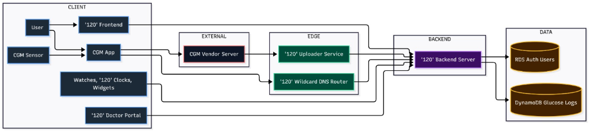

<<<<<<< HEAD
# Nightscout SaaS Backend (Python)

This is the new multi-tenant backend built with FastAPI.

## Prerequisites

-   Python 3.10+
-   PostgreSQL (NeonDB)
-   MongoDB (Atlas)

## Setup

1.  **Install Dependencies**:
    ```bash
    cd backend_python
    pip install -r requirements.txt
    ```

2.  **Configuration**:
    Ensure your `app/core/config.py` (or `.env`) has valid `MONGO_URI` and `SQLALCHEMY_DATABASE_URL`.

3.  **Initialize Database**:
    This will create the necessary tables (`tenants`, `users`, `api_keys`) in your Postgres DB.
    ```bash
    python scripts/init_db_schema.py
    ```

## Running the Server

```bash
uvicorn main:app --reload
```

## First Steps (Authentication)

1.  **Signup**:
    ```bash
    curl -X POST "http://127.0.0.1:8000/api/v1/auth/signup" \
         -H "Content-Type: application/json" \
         -d '{"email": "myuser@example.com", "password": "securepassword"}'
    ```

2.  **Login** (Get Token):
    ```bash
    curl -X POST "http://127.0.0.1:8000/api/v1/auth/login" \
         -H "Content-Type: application/json" \
         -d '{"user_id": "myuser@example.com", "password": "securepassword"}'
    ```

3.  **Get API Secret** (For Uploader):
    Use the `access_token` from the previous step.
    ```bash
    curl -X POST "http://127.0.0.1:8000/api/v1/auth/api-secret" \
         -H "Authorization: Bearer <YOUR_ACCESS_TOKEN>"
    ```

4.  **Upload Data**:
    Use the `api_secret` from step 3.
    ```bash
    curl -X POST "http://127.0.0.1:8000/api/v1/entries" \
         -H "api-secret: <YOUR_API_SECRET>" \
         -H "Content-Type: application/json" \
         -d '[{"type": "sgv", "dateString": "2023-10-27T10:00:00.000Z", "date": 1698400800000, "sgv": 120}]'
    ```
=======
# OneTwenty 🩸

**India's Unified, AI-Powered Diabetes Management Platform**

> One platform. Every CGM. Every insight. Every patient.

---

## The Problem

India has **101 million diabetics** — the highest in the world — with **50 lakh+ CGM users** growing 2x yearly. Every CGM brand (Libre, Dexcom, Medtronic) locks data into its own app. Switching sensors means losing your data, history, and insights. Doctors receive mismatched PDFs, and families can't easily monitor loved ones.

## The Solution

OneTwenty unifies glucose data from **all CGM brands** into a single multi-tenant platform with AI-powered insights, real-time family sharing, and a dedicated doctor portal — all at ₹99/month.

---

## Features & Codebase

### 📱 Patient PWA (`frontend/`)
Built with **Vite + Vanilla JS** for a lightweight, installable PWA.
- **Real-time glucose chart** — D3.js-powered graphs with trend arrows (`src/enhanced-chart.js`, `src/simple-chart.js`)
- **WebSocket live sync** — instant updates from backend (`src/websocket.js`)
- **Nightscout-compatible UI** — full renderer, care portal, bolus calculator (`src/nightscout/`)
- **AI treatment logging** — natural language input: *"Had 2 rotis, took 4 units, walked 3 km"*
- Profile management, settings, and subdomain-based auth (`src/profile.js`, `src/nightscout/hashauth.js`)

### 🖥️ Backend (`backend_python/`)
Layered **FastAPI** architecture with clean separation of concerns:
- **API Layer** — versioned REST endpoints + dependency injection (`app/api/v1/`, `app/api/deps.py`)
- **Services** — business logic for auth, entries, and tenants (`app/services/`)
- **Repositories** — data access for PostgreSQL & MongoDB (`app/repositories/`)
- **WebSocket** — tenant-scoped real-time broadcast to all connected clients (`app/websocket/`)
- **Schemas** — Pydantic models for request/response validation (`app/schemas/`)
- **Core** — config, security, and middleware (`app/core/`, `app/middleware/`)

### 👨‍👩‍👧 Family & Caregivers
- **Glucose Clock** — ambient display that glows green/orange/red, polls `/api/v1/entries/current`
- Smart high/low alerts via SMS & push

### 🏥 Doctor Portal
- Multi-patient live dashboard with cross-brand unified history
- Managed via `app/api/v1/` doctor endpoints and `app/repositories/`

---

## Architecture



---

## Tech Stack

| Layer | Technology |
|---|---|
| **Backend** | Python 3.11+, FastAPI, Uvicorn |
| **Frontend** | Vanilla JS (ES6+), Vite, D3.js |
| **Databases** | PostgreSQL 15, MongoDB 6.0, Redis |
| **Auth** | JWT + API Secrets + Subdomain-based |
| **Real-time** | WebSockets |
| **AI/ML** | AWS Bedrock (Agentic AI), SageMaker |
| **Infra** | AWS (EC2, RDS, S3, CloudFront), Docker |
| **CI/CD** | GitHub Actions |

---

## Project Structure

```
OneTwenty/
├── backend_python/     # FastAPI backend (API, WebSockets, Auth)
├── frontend/           # Vite + Vanilla JS PWA
├── requirements.md     # Detailed product requirements (16 user stories)
├── README.md           # This file
└── design.md           # System design & architecture document
```

---

## Getting Started

### Prerequisites
- Python 3.11+
- Node.js 18+
- PostgreSQL 15
- MongoDB 6.0

### Backend Setup

```bash
cd backend_python
python -m venv venv
# On Windows:
.\venv\Scripts\activate
# On macOS/Linux:
source venv/bin/activate

pip install -r requirements.txt
# Configure environment variables (DB connections, secrets)
uvicorn main:app --reload
```

### Frontend Setup

```bash
cd frontend
npm install
npm run dev
```

---

## Documentation

- **[requirements.md](./requirements.md)** — Full product requirements with 16 detailed user stories covering CGM integration, AI logging, doctor portal, family sharing, voice assistants, and more.
- **[design.md](./design.md)** — Complete system design document including architecture diagrams, database schema, authentication flows, real-time data pipeline, scalability strategy, and deployment architecture.

---

## Roadmap

| Phase | Timeline | Milestone |
|---|---|---|
| **MVP** | Current | Multi-tenant backend + PWA + Real-time sync |
| **Phase 2** | 2 weeks | AI Chat (Bedrock) + Built-in CGM uploaders |
| **Phase 3** | 2 weeks | Alexa/Google Home + ABDM + Multi-language |

---

## License

This project is proprietary. All rights reserved.

---

*Built with purpose. Built from scratch. Built for Bharat.* 🇮🇳
>>>>>>> origin
